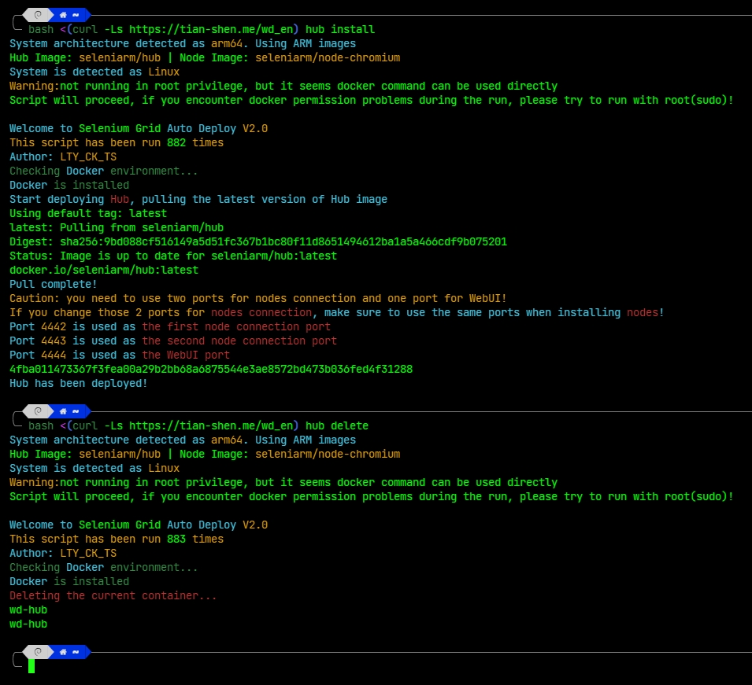

<h1 align="center">Selenium Grid Docker</h1>
<p align="center">
    <a href="https://github.com/sahuidhsu/selenium-grid-docker/stargazers" style="text-decoration:none" >
        
    </a>
    <a href="https://github.com/sahuidhsu/selenium-grid-docker/blob/main/LICENSE" style="text-decoration:none" >
        
    </a>
    
    
    
</p>
<h3 align="center"><a href="README.md">中文文档</a> | English </h3>
<h3 align="center">A convenient and quick Selenium WebDriver Docker deployment script </h3>
<h4 align="center">System supported: Linux, macOS</h4>
<h4 align="center">Architecture supported: x86_64, arm64, arm32v7</h4>

## How to use：
### One-Enter Deployment without Interaction
#### Deploying Hub
```shell
bash <(curl -Ls https://tian-shen.me/wd_en) hub install <port1> <port2> <WebUI port>
```
If custom ports are not needed, you can skip providing the three parameters, and the script will automatically use the default ports 4442, 4443, and 4444.
> [!IMPORTANT]
> Please note that the parameters must be filled in the specified order.
> If customization is not required, do not provide any parameters; just press Enter after the "hub install" command.
#### Deploying Node
```shell
bash <(curl -Ls https://tian-shen.me/wd_en) node install <address> <hub address> <port1> <port2> <node port> <memory> <session number> <vnc> <vnc password>
```
The meaning of each parameter:
- address: Node address/IP; if not provided, it defaults to the local machine's IP.
- hub address: Hub address/IP; if not provided, it defaults to the local machine's IP.
- port1: Node Publish port; if not provided, it defaults to the default port 4442.
- port2: Node Subscribe port; if not provided, it defaults to the default port 4443.
- node port: Node port; if not provided, it defaults to the default port 5556.
- memory: Node memory; if not provided, it defaults to 512m.
- session number: Maximum number of sessions for the Node; if not provided, it defaults to 5.
- vnc: Switch for VNC function; enter 'y' to enable. If enabled, also provide the VNC password. 
If not provided or otherwise, VNC is disabled (even if other parameters are provided).
- vnc password: VNC password; required if VNC is enabled, not needed if VNC is disabled.
> [!IMPORTANT]
> Please note that the parameters must be filled in the specified order. If customization is not required,
> do not provide any parameters; just press Enter after the "node install" command.
>
> Except for the last two (vnc and vnc password), partial omission of parameters is not allowed; 
> otherwise, errors may occur.
#### Update Hub (using WatchTower)
```shell
bash <(curl -Ls https://tian-shen.me/wd_en) hub update
```
#### Delete Hub
```shell
bash <(curl -Ls https://tian-shen.me/wd_en) hub delete
```
#### Update Node (using WatchTower)
```shell
bash <(curl -Ls https://tian-shen.me/wd_en) node update
```
#### Delete Node
```shell
bash <(curl -Ls https://tian-shen.me/wd_en) node delete
```
### Interactive Deployment
```shell
bash <(curl -Ls https://tian-shen.me/wd_en)
```
or
```shell
bash <(curl -Ls https://raw.githubusercontent.com/sahuidhsu/selenium-grid-docker/main/wd_en.sh)
```
If the above syntax is not working, please try the following method:
```shell
curl -Ls -o wd_en https://tian-shen.me/wd_en && chmod +x wd_en && ./wd_en
```

## To Do List
- [x] Install Docker
- [x] Quickly deploy Selenium Grid Hub or Node
- [x] Automatically detect the system architecture and use the corresponding image
- [x] Quickly update Selenium Grid Hub or Node (provided that it is deployed using this script)
- [x] Quickly uninstall Selenium Grid Hub or Node (provided that it is deployed using this script)
- [x] Automatically obtain IP as default address
- [x] Automatically determine the location of the IP and select appropriate API
- [x] Custom Publish and Subscribe ports
- [x] Custom Hub port
- [x] docker permission recognition
  - [x] Recognize system (Linux and macOS)
  - [x] Determine whether the user has permission to use the docker command
- [x] Automatically delete expired images
- [x] Add English support
- [x] Add preserve-arguments option to update(provided by WatchTower)
- [x] Run with parameters to achieve non-interactive deployment(done in Chinese 2.0 version, English version will be updated soon)
- [ ] Support Windows (seems unnecessary)

## Usage example


## Buy me a coffee
[](https://ko-fi.com/ltyckts)