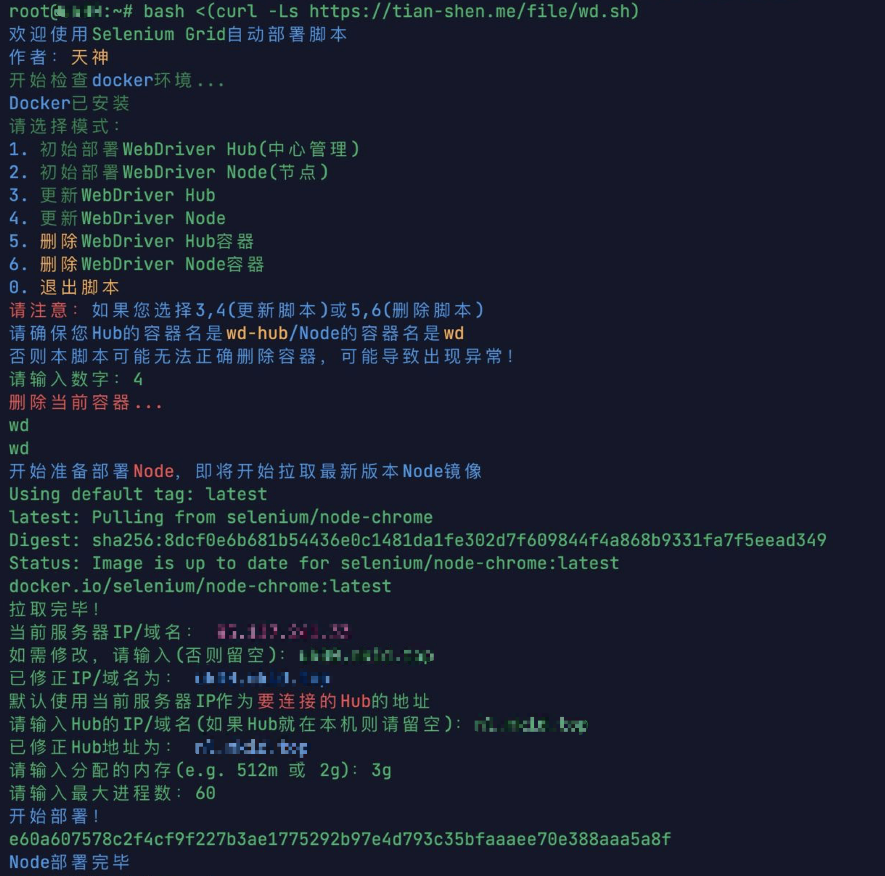

# selenium-grid-docker
A convenient and quick Selenium WebDriver Docker deployment script \
Currently supported systems: **Linux**, **macOS** \
Currently supported architectures: **x86_64**, **arm64**, **arm32v7**

[中文版](README.md)

## How to use：
```shell
bash <(curl -Ls https://tian-shen.me/file/wd.sh)
```
or
```shell
bash <(curl -Ls https://raw.githubusercontent.com/sahuidhsu/selenium-grid-docker/main/wd.sh)
```
If the above syntax is not working, please try the following method:
```shell
curl -Ls https://tian-shen.me/file/wd.sh | bash
```

## To Do List
- [x] Install Docker
- [x] Quickly deploy Selenium Grid Hub or Node
- [x] Automatically detect the system architecture and use the corresponding image
- [x] Quickly update Selenium Grid Hub or Node (provided that it is deployed using this script)
- [x] Quickly uninstall Selenium Grid Hub or Node (provided that it is deployed using this script)
- [x] Automatically obtain IP as default address
- [x] Custom Publish and Subscribe ports
- [x] Custom Hub port
- [x] docker permission recognition
  - [x] Recognize system (Linux and macOS)
  - [x] Determine whether the user has permission to use the docker command
- [x] Automatically delete expired images
- [ ] Run with parameters to achieve non-interactive deployment
- [ ] Support Windows (seems unnecessary)
- [ ] Add English output for the script

## Usage example (initial version screenshot, there is a difference with the latest version)

